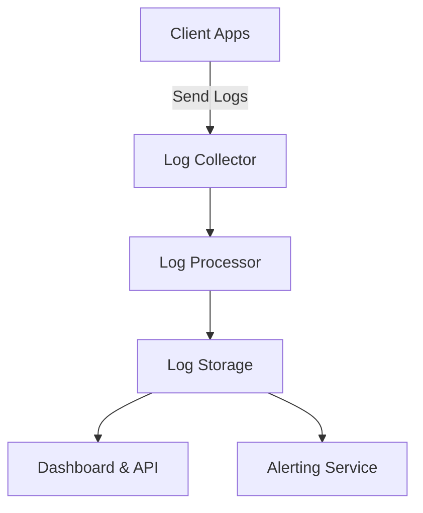

# Log-Aggregation-Platform

# Log Aggregation Platform

A scalable platform for collecting, processing, and analyzing logs from distributed systems.  
This project provides real-time log aggregation, powerful query capabilities, and user-friendly dashboards to help you monitor and troubleshoot your applications.

## Table of Contents

- [Features](#features)
- [Architecture](#architecture)
- [Getting Started](#getting-started)
- [Installation](#installation)
- [Usage](#usage)
- [Configuration](#configuration)
- [API Reference](#api-reference)
- [Contributing](#contributing)
- [License](#license)
- [Contact](#contact)

## Features

- **Centralized Log Collection**: Aggregate logs from multiple sources.
- **Real-time Processing**: Stream and process logs in real-time.
- **Powerful Query Engine**: Search and filter logs using flexible queries.
- **Dashboards**: Visualize log data with customizable dashboards.
- **Alerting System**: Set up alerts for critical events and errors.
- **Scalability**: Designed to scale horizontally for large volumes of data.
- **Extensible**: Easily integrate with new data sources and outputs.

## Architecture



- **Collector**: Receives logs via HTTP, TCP, or other protocols.
- **Processor**: Parses, filters, and enriches log entries.
- **Storage**: Persists logs in a scalable database.
- **Dashboard & API**: Provides UI and endpoints for access.
- **Alerting Service**: Monitors logs and triggers alerts.

## Getting Started

### Quick Start

```bash
git clone https://github.com/EmyysJanaK/Log-Aggregation-Platform.git
cd Log-Aggregation-Platform
docker-compose up
```

## Installation

See the [docs/INSTALLATION.md](docs/INSTALLATION.md) for detailed instructions.

## Usage

1. Configure your log sources to send logs to the platform.
2. Access the dashboard at `http://localhost:8080`.
3. Use the API to query and manage logs.

## Configuration

Configuration files are located in the `config/` directory.  
See [docs/CONFIGURATION.md](docs/CONFIGURATION.md) for options and examples.

## API Reference

Full API documentation is available in [docs/API.md](docs/API.md).

## Contributing

We welcome contributions!

- Please read [CONTRIBUTING.md](CONTRIBUTING.md) for guidelines.
- Check [issues](https://github.com/EmyysJanaK/Log-Aggregation-Platform/issues) for work you can pick up.

## License

This project is licensed under the MIT License—see the [LICENSE](LICENSE) file for details.


